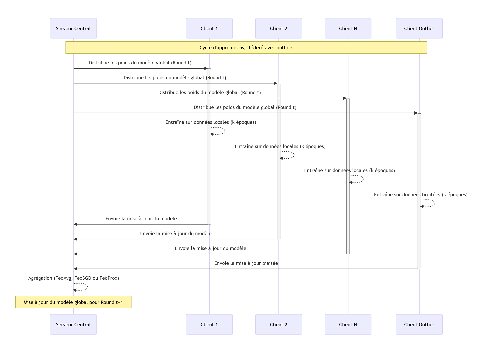
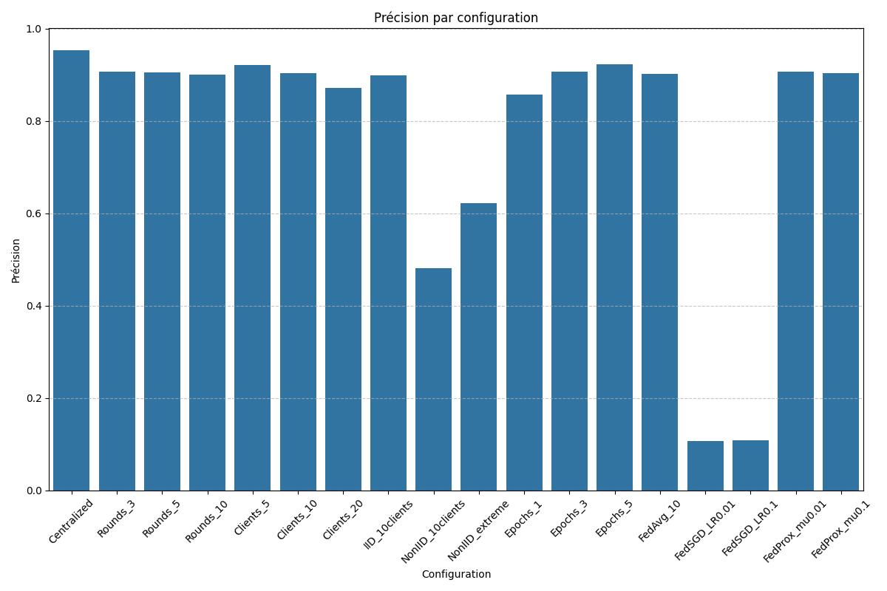
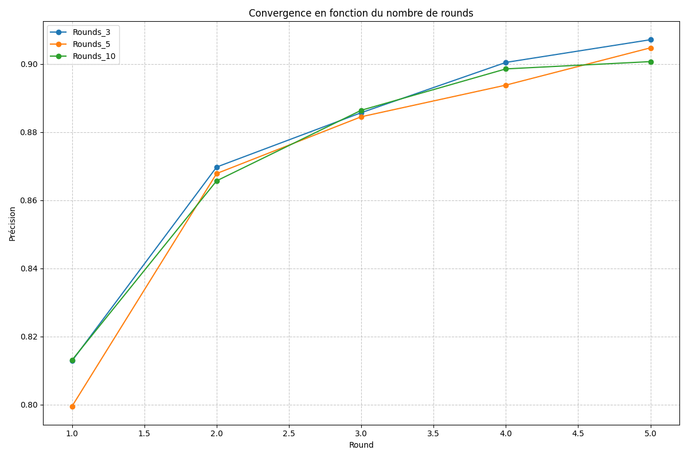
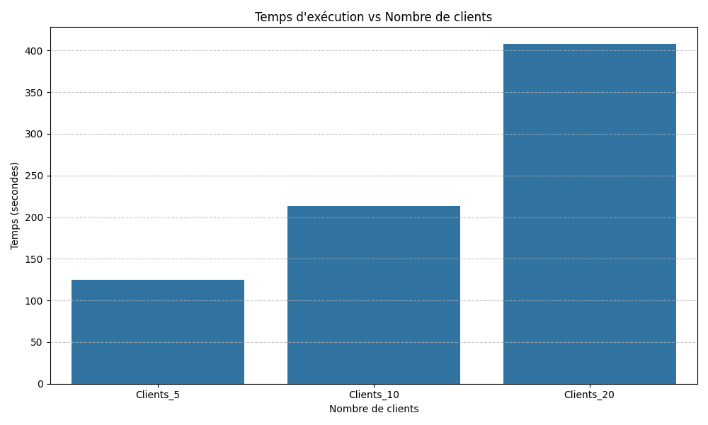
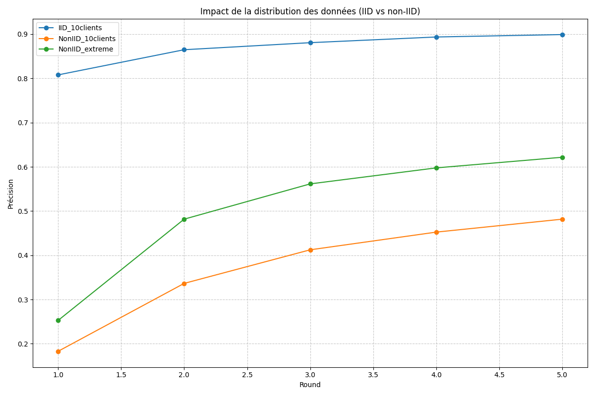
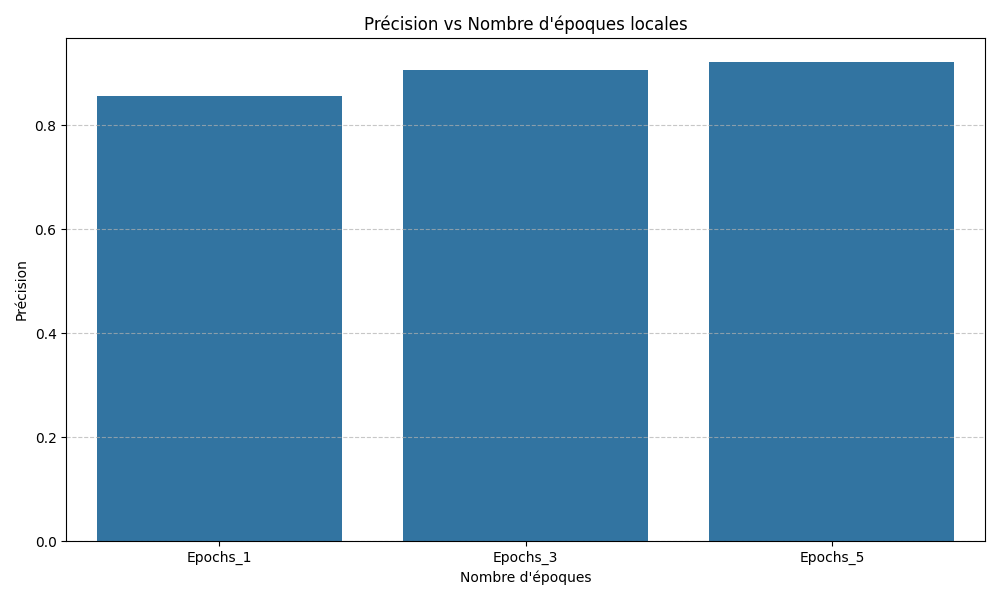
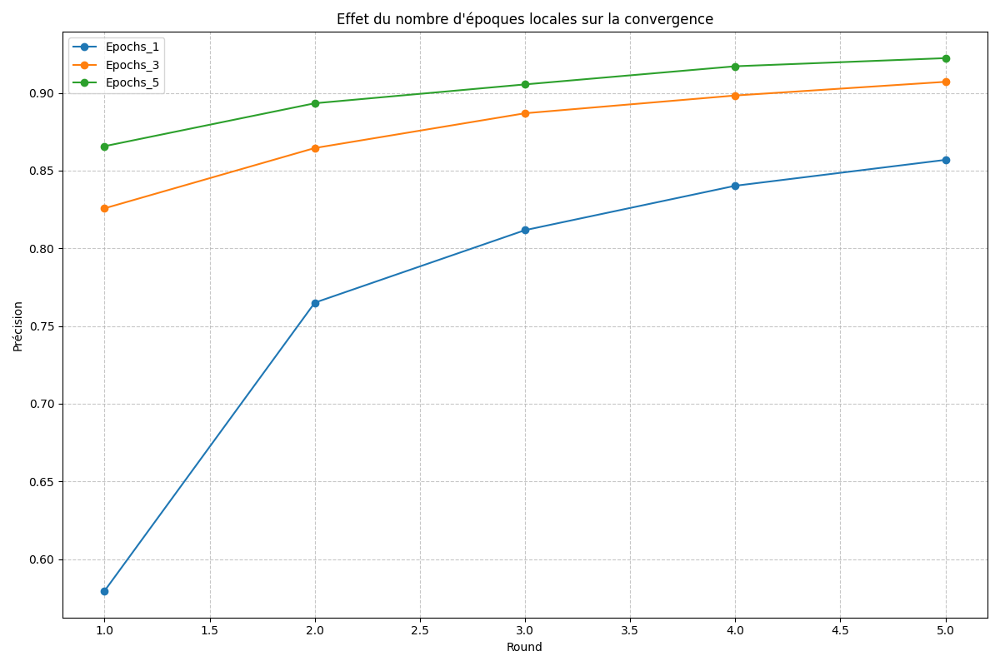
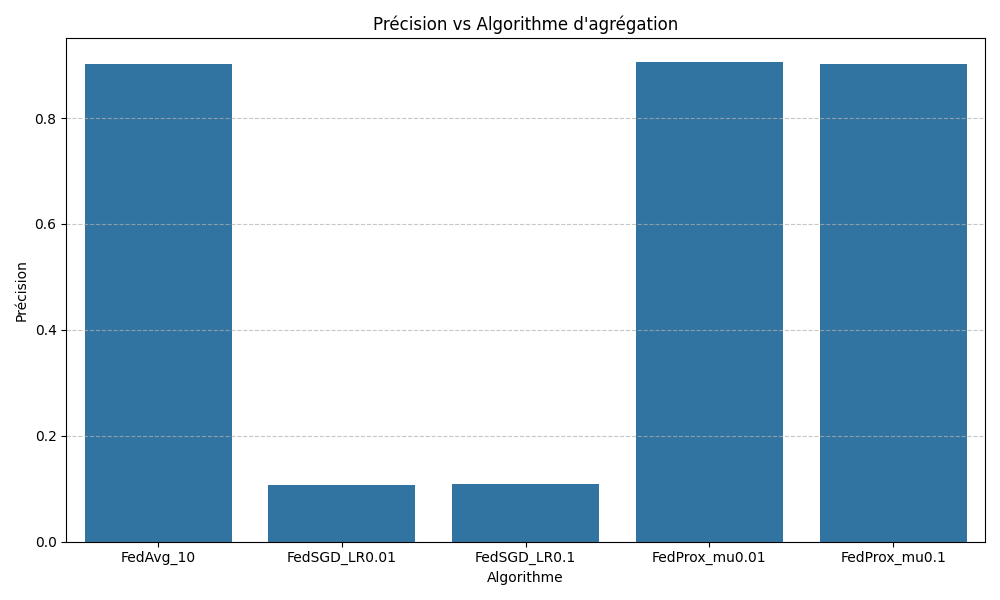
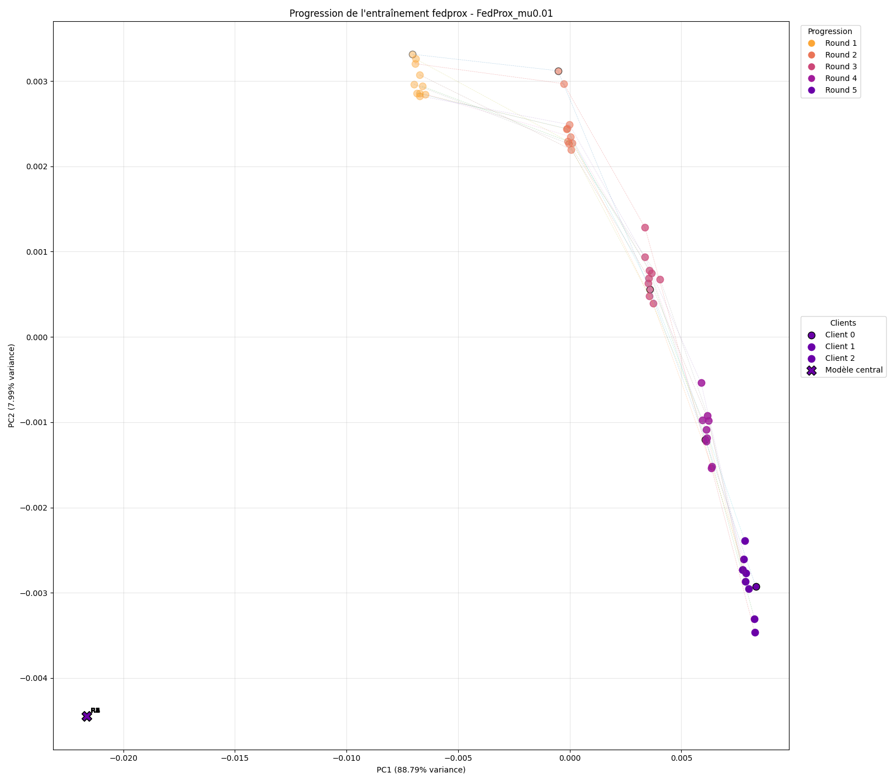
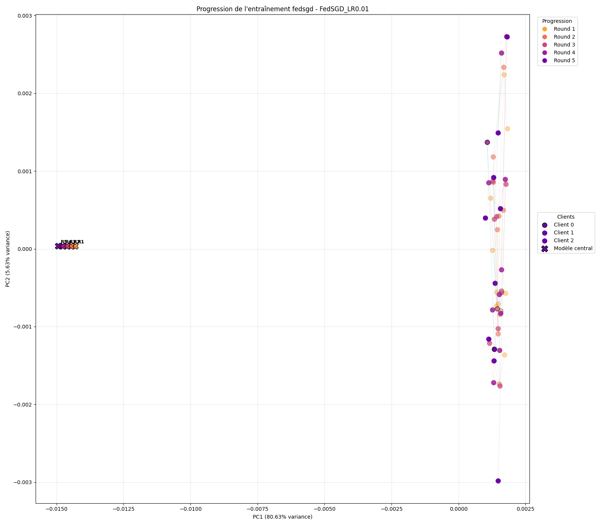

<div class="title">Apprentissage Fédéré</div>
<div class="separator"></div>
<div class="subtitle">Implémentation et analyse sur le jeu de données MNIST</div>

<div class="authors">
<p>Clément COLIN</p>
<p>Enzo ROCAMORA</p>
<p>Thomas CHOUBRAC</p>
</div>

<div class="authors">
<p>Avril 2025<p>
</div>

<div class="page"/>

## Sommaire

1. [Introduction](#introduction)

2. [Jeu de données MNIST](#jeu-de-données-mnist)

3. [Architecture et méthodologie](#architecture-du-modèle-et-méthodologie-expérimentale)

4. [Distribution des données](#distribution-des-données-entre-clients)

5. [Algorithmes d'agrégation](#algorithmes-dagrégation)

6. [Expérimentations et paramètres](#paramètres-étudiés-et-expérimentations)

7. [Résultats et analyse](#résultats-et-analyse)

8. [Conclusion et perspectives](#conclusion-et-perspectives)

<div class="page"/>

## Introduction

L'apprentissage fédéré répond à plusieurs enjeux. D'une part, il respecte la confidentialité des données, sujet sensible depuis l'entrée en vigueur du RGPD. D'autre part, il permet de tirer parti de données distribuées géographiquement sans avoir à les centraliser, ce qui peut s'avérer impossible pour des raisons techniques, légales ou d'évolution constante des données.

Notre objectif a été d'implémenter et d'analyser différentes variantes d'apprentissage fédéré sur le jeu de données MNIST, afin de comprendre les impacts de divers paramètres sur les performances des modèles.

## Fondements théoriques de l'apprentissage fédéré

### Principe général

<script type="text/javascript" src="http://cdn.mathjax.org/mathjax/latest/MathJax.js?config=TeX-AMS-MML_HTMLorMML"></script>
<script type="text/x-mathjax-config">
  MathJax.Hub.Config({ tex2jax: {inlineMath: [['$', '$']]}, messageStyle: "none" });
</script>

L'apprentissage fédéré se déroule généralement en trois étapes principales :

1. Un serveur central initialise un modèle global et le distribue aux clients
2. Chaque client entraîne le modèle sur ses données locales
3. Les mises à jour des modèles locaux sont agrégées par le serveur central

Mathématiquement, l'objectif est de résoudre un problème d'optimisation de la forme :

$$\min_{w \in \mathbb{R}^d} f(w)$$

où $f(w)$ est décomposable sous forme d'une somme finie :

$$f(w) = \frac{1}{N} \sum_{i=1}^{N} f_i(w)$$

Dans le contexte du machine learning, la fonction $f_i$ représente la fonction de perte pour le point de données $i$ :

$$f_i(w) = \text{loss}(x_i, y_i; w)$$

Lorsque les données sont réparties entre $K$ clients, nous pouvons réécrire l'objectif comme :

$$f(w) = \sum_{k=1}^{K} \frac{n_k}{n} F_k(w)$$

où $F_k(w) = \frac{1}{n_k} \sum_{i \in P_k} f_i(w)$ est la fonction objective locale du client $k$, $P_k$ est l'ensemble des indices des points de données du client $k$, $n_k = |P_k|$ est le nombre de données du client $k$, et $n = \sum_{k=1}^{K} n_k$ est le nombre total de données.

<div class="page"/>

## Jeu de données MNIST

Pour notre étude, nous avons utilisé le jeu de données MNIST, qui contient des images en niveaux de gris de chiffres manuscrits (de 0 à 9). Voici ses caractéristiques principales :

- 37 800 images d'entraînement
- 4 200 images de test
- Dimensions des images : 28×28 pixels (en niveaux de gris)

La distribution des classes dans l'ensemble d'entraînement est relativement équilibrée, avec environ 10% des images pour chaque chiffre. Cette répartition équilibrée nous a permis d'expérimenter facilement différentes stratégies de distribution entre clients.

Pour charger et prétraiter ces données, nous avons implémenté le module `fl_dataquest.py` qui convertit les images en tenseurs normalisés et crée des pipelines TensorFlow efficaces :

```python
def get_data(img_path = '../Mnist/trainingSet/trainingSet/', verbose = 0):
    # Chargement et prétraitement des images MNIST
    image_paths = list(list_images(img_path))
    il, ll = load_and_preprocess(image_paths, verbose=10000)
    
    # Binarisation des labels (one-hot encoding)
    lb = skl.preprocessing.LabelBinarizer()
    ll = lb.fit_transform(ll)
    
    # Division en ensembles d'entraînement et de test
    X_train, X_test, y_train, y_test = train_test_split(il, ll, 
                                                       test_size=0.1, 
                                                       random_state=19)
    
    return X_train, X_test, y_train, y_test, X_train[0].shape
```

## Tentative d'application sur d'autres jeux de données

Nous avons également exploré l'utilisation d'autres jeux de données, notamment le dataset Auto-MPG (Session 2). Mais nous avons rencontré plusieurs obstacles. La taille réduite du jeu de données rendait difficile une distribution significative entre plusieurs clients. De plus, les caractéristiques numériques continues présentaient des distributions très hétérogènes, ce qui entraînait des problèmes de convergence dans le cadre de l'apprentissage fédéré. Nos tests préliminaires ont montré des écarts de performance considérables entre les différents clients, selon la distribution des données.

<div class="page"/>

## Architecture du modèle et méthodologie expérimentale

### Prérequis et installation

Pour exécuter notre implémentation d'apprentissage fédéré, vous aurez besoin d'installer les bibliothèques Python suivantes.

```bash
pip install tensorflow numpy matplotlib scikit-learn opencv-python pandas seaborn psutil
```

### Structure du projet

Notre projet est organisé en plusieurs modules Python :

- `fl_model.py` : Définition du modèle neuronal
- `fl_types.py` : Implémentation de l'apprentissage fédéré horizontal
- `fl_dataquest.py` : Chargement et prétraitement des données MNIST
- `data_partition.py` : Fonctions pour la répartition des données entre clients
- `aggregation.py` : Algorithmes d'agrégation (FedAvg, FedSGD, FedProx)
- `utils.py` : Fonctions utilitaires
- `communication_utils.py` : Utilitaires pour suivre les communications dans l'apprentissage fédéré
- `fairness_utils.py` : Utilitaires pour analyser l'équité entre clients et calculer les matrices de confusion
- `outlier_analysis.py` : Expériences et visualisations pour l'impact des outliers et du bruit
- `run_all.py` : Script principal pour exécuter toutes les expériences

### Exécution des expériences

Pour lancer l'ensemble des expériences, exécutez simplement le script principal :

```bash
python run_all.py
```

Ce script va :
1. Charger les données MNIST
2. Créer un modèle centralisé de référence
3. Exécuter toutes les configurations d'apprentissage fédéré définies
4. Évaluer les performances de chaque configuration
5. Générer des visualisations et sauvegarder les résultats

L'exécution complète peut prendre plusieurs heures selon votre matériel, car de nombreuses configurations sont testées (nombre de clients, de rounds, d'époques locales, différents algorithmes, etc.).

Vous pouvez donc sélectionner les configurations à exécuter en commentant ou décommentant les lignes correspondantes dans la liste des configurations du script ligne 75 dans `run_all.py`.

Par exemple:

```py
configurations = [
    # Nombre de rounds fédérés
    {'name': 'Rounds_3', 'num_clients': 10, 'distribution': 'iid', 'algo': 'fedavg', 'epochs': 3, 'rounds': 3},
    {'name': 'Rounds_5', 'num_clients': 10, 'distribution': 'iid', 'algo': 'fedavg', 'epochs': 3, 'rounds': 5},
    # {'name': 'Rounds_10', 'num_clients': 10, 'distribution': 'iid', 'algo': 'fedavg', 'epochs': 3, 'rounds': 10},  # Configuration désactivée
    
    # Nombre de clients
    {'name': 'Clients_5', 'num_clients': 5, 'distribution': 'iid', 'algo': 'fedavg', 'epochs': 3, 'rounds': 5},
    {'name': 'Clients_10', 'num_clients': 10, 'distribution': 'iid', 'algo': 'fedavg', 'epochs': 3, 'rounds': 5},
    {'name': 'Clients_20', 'num_clients': 20, 'distribution': 'iid', 'algo': 'fedavg', 'epochs': 3, 'rounds': 5},
]
```

<div class="page"/>

### Fichiers générés

1. **Résultats CSV** :
   - `federated_learning_results.csv` : Résumé des performances finales de chaque configuration
   - `federated_learning_detailed_results.csv` : Résultats détaillés round par round

2. **Visualisations** :
   - Dossier `plots/` : Graphiques comparatifs des différentes configurations

3. **Visualisations de progression** :
   - Dossier `progression_plots/` : Visualisations PCA de la trajectoire des paramètres

4. **Historique des paramètres** :
   - Dossier `parameter_history/` : Fichiers pickle contenant l'historique des paramètres pour chaque configuration

### Architecture générale

L'architecture générale de notre système d'apprentissage fédéré repose sur trois composants principaux :

1. **Serveur central** : Coordonne le processus d'apprentissage, agrège les mises à jour des modèles clients
2. **Clients (edges)** : Entraînent des modèles locaux sur leurs données privées
3. **Modèle global** : Résultat de l'agrégation des modèles locaux

Le flux de données et d'informations est unidirectionnel pour les données (qui restent sur les appareils clients) et bidirectionnel pour les paramètres du modèle.

### Cycle d'apprentissage fédéré

Chaque round d'apprentissage fédéré suit les étapes suivantes :

1. Le serveur central initialise les poids du modèle global ou utilise les poids de la dernière itération
2. Le serveur distribue ces poids à tous les clients participants
3. Chaque client entraîne le modèle sur ses données locales pendant un nombre prédéfini d'époques
4. Chaque client calcule la mise à jour de ses poids (différence entre poids initiaux et poids après entraînement)
5. Les clients envoient leurs mises à jour (ou leurs poids complets) au serveur
6. Le serveur agrège ces mises à jour selon l'algorithme choisi (FedAvg, FedSGD, FedProx)
7. Le serveur met à jour le modèle global avec les poids agrégés
8. Le processus se répète à partir de l'étape 2 pour le round suivant



### Modèle neuronal

Pour notre étude, nous avons utilisé un réseau de neurones multicouche (MLP) implémenté dans la classe `MyModel` du module `fl_model.py` :

```python
class MyModel():
    def __init__(self, input_shape, nbclasses):
        model = Sequential()
        model.add(Input(input_shape))
        model.add(Flatten())
        model.add(Dense(128))
        model.add(Activation("relu"))
        model.add(Dense(64))
        model.add(Activation("relu"))
        model.add(Dense(nbclasses))
        model.add(Activation("softmax"))

        self.model = model
        self.input_shape = input_shape
        self.classes = nbclasses

        self.loss_fn = 'categorical_crossentropy'
        self.model.compile(optimizer="SGD", loss=self.loss_fn, metrics=["accuracy"])
```

Cette architecture relativement simple est suffisante pour obtenir de bons résultats sur MNIST tout en restant légère en termes de calcul, ce qui est important dans un contexte d'apprentissage fédéré où les ressources des clients peuvent être limitées.

### Mécanisme d'apprentissage fédéré

Le cœur de notre implémentation repose sur la fonction `horizontal_federated_learning` du module `fl_types.py`, qui coordonne l'entraînement entre le serveur central et les clients :

```python
def horizontal_federated_learning(edges, central_model, input_shape, num_classes, 
                                 edge_epochs, test_data, aggregation_fn, verbose=0):
    '''Apprentissage fédéré horizontal (HFL)'''
    central_weights = central_model.get_weights()
    scaled_local_weight_list = []
    
    # Pour chaque client
    edges_names = list(edges.keys())
    random.shuffle(edges_names)
    
    for client_name in edges_names:
        # Obtenir les données du client
        client_data = edges[client_name]
        
        # Créer et configurer le modèle local
        local_model = fl_model.MyModel(input_shape, nbclasses=num_classes)
        local_model.set_weights(central_weights)
        
        # Entraîner le modèle local
        local_model.fit_it(trains=client_data, epochs=edge_epochs, tests=test_data, verbose=verbose)
        
        # Calculer le facteur d'échelle
        scaling_factor = _weight_scaling_factor(edges, client_name)
        scaled_weights = _scale_model_weights(local_model.get_weights(), scaling_factor)
        scaled_local_weight_list.append(scaled_weights)
        
        # Nettoyer la session
        K.clear_session()
    
    # Agréger les poids et mettre à jour le modèle central
    updated_weights = aggregation_fn(scaled_local_weight_list)
    central_model.set_weights(updated_weights)
    
    return central_model
```

<div class="page"/>

Cette fonction implémente les étapes clés de l'apprentissage fédéré horizontal :
1. Distribution du modèle global à tous les clients
2. Entraînement local sur chaque client pendant un nombre spécifié d'époques
3. Calcul d'un facteur d'échelle pour chaque client proportionnel à la quantité de données dont il dispose
4. Agrégation des poids mis à l'échelle via une fonction d'agrégation spécifiée
5. Mise à jour du modèle central avec les poids agrégés

### Distribution des données entre clients

Un aspect essentiel de notre étude était d'expérimenter avec différentes stratégies de distribution des données entre clients. Nous avons implémenté trois types de distribution :

1. **Distribution IID** (Independent and Identically Distributed) : les données sont réparties aléatoirement entre les clients, garantissant une distribution similaire des classes pour chaque client.

```python
def iid_partition(X, y, num_clients, batch_size=32):
    '''Distribution IID: chaque client a des données indépendantes et identiquement distribuées'''
    data = list(zip(X, y))
    random.shuffle(data)
    
    size = len(data)//num_clients
    shards = [data[i:i + size] for i in range(0, size*num_clients, size)]
    
    client_data = {}
    for i in range(num_clients):
        client_name = f'edge_{i}'
        
        client_X, client_y = zip(*shards[i])
        client_X, client_y = list(client_X), list(client_y)
        
        dataset = tf.data.Dataset.from_tensor_slices((client_X, client_y))
        dataset = dataset.shuffle(len(client_y))
        dataset = dataset.batch(batch_size)
        
        client_data[client_name] = dataset
    
    return client_data
```

<div class="page"/>

2. **Distribution non-IID** : chaque client reçoit un sous-ensemble biaisé des classes, créant une hétérogénéité dans la distribution des données.

```python
def non_iid_partition(X, y, num_clients, classes_per_client=2, batch_size=32):
    '''Distribution non-IID: chaque client a un sous-ensemble déséquilibré des classes'''
    labels = np.argmax(y, axis=1)
    sorted_indices = np.argsort(labels)
    
    X_sorted = [X[i] for i in sorted_indices]
    y_sorted = [y[i] for i in sorted_indices]
    
    # Compter combien de classes nous avons
    num_classes = y[0].shape[0]
    samples_per_class = len(X) // num_classes
    
    # Répartir les données entre les clients
    client_data = {}
    for i in range(num_clients):
        client_name = f'edge_{i}'
        client_X, client_y = [], []
        
        # Pour chaque client, sélectionner classes_per_client classes
        selected_classes = np.random.choice(range(num_classes), classes_per_client, replace=False)
        
        # ... [code pour allouer les données selon les classes sélectionnées] ...
        
        # Créer le dataset pour ce client
        dataset = tf.data.Dataset.from_tensor_slices((client_X, client_y))
        dataset = dataset.shuffle(len(client_y))
        dataset = dataset.batch(batch_size)
        
        client_data[client_name] = dataset
    
    return client_data
```

3. **Distribution non-IID extrême** : chaque client se spécialise presque exclusivement sur une ou deux classes, avec très peu d'exemples des autres classes.

Ces différentes distributions nous permettent d'étudier la robustesse des algorithmes d'apprentissage fédéré face à l'hétérogénéité des données, un défi majeur dans les applications réelles.

<div class="page"/>

### Algorithmes d'agrégation

Nous avons implémenté et comparé trois algorithmes d'agrégation principaux :

1. **FedAvg** (Federated Averaging) : l'algorithme standard qui calcule une moyenne pondérée des poids des modèles locaux.

**Formule mathématique** : 
$$w_{t+1} = \sum_{k=1}^{K} \frac{n_k}{n} w_k^{t+1}$$

où:
- $w_{t+1}$ représente les poids globaux à l'iteration $t+1$
- $w_k^{t+1}$ représente les poids du client $k$ après entraînement local
- $n_k$ est le nombre d'exemples du client $k$
- $n$ est le nombre total d'exemples

**Caractéristiques** :
- Simple et efficace
- Convergence relativement rapide
- Relativement robuste aux outliers (comme montré dans nos expériences)
- Sensible à l'hétérogénéité des données (distribution non-IID)

```python
def fedavg(scaled_weight_list, central_weights=None, config_name=None, round_num=None): 
    avg_weights = list()
    for grad_list_tuple in zip(*scaled_weight_list):
        layer_mean = tf.math.reduce_sum(grad_list_tuple, axis=0)
        avg_weights.append(layer_mean)
    
    return avg_weights
```

2. **FedSGD** (Federated Stochastic Gradient Descent) : agrégation basée sur les gradients plutôt que sur les poids eux-mêmes.

**Formule mathématique** :
$$w_{t+1} = w_t - \eta \sum_{k=1}^{K} \frac{n_k}{n} \nabla F_k(w_t)$$

où:
- $\nabla F_k(w_t)$ est le gradient de la fonction objectif du client $k$
- $\eta$ est le taux d'apprentissage

**Caractéristiques** :
- Nécessite moins de communication que FedAvg (uniquement les gradients)
- Convergence généralement plus lente
- Sensible au choix du taux d'apprentissage
- Moins robuste aux outliers que FedAvg

```python
def fedsgd(model, client_grads, learning_rate=0.01, central_weights=None, config_name=None, round_num=None):
    current_weights = model.get_weights()
    updated_weights = []
    for i in range(len(current_weights)):
        updated_weights.append(current_weights[i] - learning_rate * avg_grads[i])
    
    return updated_weights
```

3. **FedProx** (Federated Proximal) : une extension de FedAvg qui ajoute un terme de régularisation proximal pour limiter la divergence entre les modèles.

**Formule mathématique** :
$$F_k(w) = L_k(w) + \frac{\mu}{2} ||w - w_t||^2$$

où:
- $L_k(w)$ est la fonction de perte originale du client $k$
- $\mu$ est le paramètre de régularisation proximal
- $w_t$ est le modèle global à l'itération $t$

**Caractéristiques** :
- Plus stable que FedAvg en présence de données hétérogènes
- Convergence plus uniforme entre les clients
- Paramètre $\mu$ à ajuster selon le degré d'hétérogénéité

```python
def fedprox(scaled_weight_list, global_weights, mu=0.01, config_name=None, round_num=None):
    avg_weights = []
    for grad_list_tuple in zip(*scaled_weight_list):
        layer_mean = tf.math.reduce_sum(grad_list_tuple, axis=0)
        avg_weights.append(layer_mean) 
    for i in range(len(avg_weights)):
        proximal_term = mu * (avg_weights[i] - global_weights[i])
        avg_weights[i] = avg_weights[i] - proximal_term
    return avg_weights
```

## Paramètres étudiés et expérimentations

Dans nos expériences, nous avons fait varier plusieurs paramètres clés :

1. **Nombre de rounds fédérés** (3, 5, 10) : combien de fois les clients et le serveur échangent des mises à jour.
2. **Nombre de clients** (5, 10, 20) : combien d'entités participent à l'apprentissage fédéré.
3. **Distribution des données** (IID, non-IID, non-IID extrême) : comment les données sont réparties entre les clients.
4. **Nombre d'époques locales** (1, 3, 5) : combien d'époques d'entraînement chaque client effectue localement.
5. **Algorithmes d'agrégation** (FedAvg, FedSGD avec différents taux d'apprentissage, FedProx avec différentes valeurs du paramètre μ).

Ces expériences ont été exécutées via le script `run_all.py`, qui implémente une boucle complète d'expérimentation :

```python
def run_all_experiments():
    # ... [initialisation] ...
    
    configurations = [
        {'name': 'Rounds_3', 'num_clients': 10, 'distribution': 'iid', 'algo': 'fedavg', 'epochs': 3, 'rounds': 3},
        {'name': 'Rounds_5', 'num_clients': 10, 'distribution': 'iid', 'algo': 'fedavg', 'epochs': 3, 'rounds': 5},
        # ... [autres configurations] ...
    ]
    
    for config in configurations:
        # ... [répartition des données selon la configuration] ...
        
        for round_num in range(num_rounds):
            federated_model = fl_types.horizontal_federated_learning(
                edges=edges,
                central_model=federated_model,
                input_shape=input_shape,
                num_classes=10,
                edge_epochs=config['epochs'],
                test_data=test_dataset,
                aggregation_fn=agg_fn,
                verbose=0
            )
            
            round_loss, round_acc = federated_model.evaluate(test_dataset, verbose=0)
            # ... [enregistrement des résultats] ...
```

<div class="page"/>

## Résultats et analyse

### Comparaison avec l'entraînement centralisé

Notre modèle de référence, entraîné de manière centralisée avec accès à toutes les données, atteint une précision de 95% après 10 époques. Aucune des configurations fédérées n'atteint tout à fait cette performance, ce qui était attendu étant donné les contraintes de l'apprentissage distribué. Cependant, les meilleures configurations fédérées parviennent à des performances respectables, jusqu'à 92% dans certains cas.

<div align="center">
    
</div>

<div class="page"/>

### Influence du nombre de rounds fédérés

Nos expériences montrent que la précision augmente avec le nombre de rounds, mais avec des rendements décroissants. Après 5 rounds, les configurations avec 3, 5 et 10 rounds atteignent respectivement 90,7%, 90,5% et 90,1% de précision. Cette similitude suggère qu'au-delà de 5 rounds, le gain de performance devient marginal pour cette tâche.

<div align="center">
    
</div>

La convergence suit une courbe typique d'apprentissage : rapide au début, puis qui ralentit progressivement. Cette observation est importante pour optimiser les ressources dans un déploiement réel.

<div class="page"/>

### Impact du nombre de clients

Nous avons observé une relation inverse entre le nombre de clients et la précision du modèle final. Avec 5 clients, la précision atteint 92%, tandis qu'avec 10 et 20 clients, elle baisse respectivement à 90% et 87%.

<div align="center">
    
</div>

Cette dégradation peut s'expliquer par plusieurs facteurs :
1. Moins de données par client, limitant la capacité d'apprentissage individuelle
2. Plus grande diversité de mises à jour, créant potentiellement des interférences lors de l'agrégation
3. Augmentation quasi-linéaire du temps de calcul (125s pour 5 clients, 213s pour 10 clients, 408s pour 20 clients)

<div class="page"/>

### Influence de la distribution des données

La distribution des données entre clients s'est avérée être le facteur le plus critique. En configuration IID, le modèle atteint 90% de précision. En revanche, en configuration non-IID, la performance chute drastiquement à 48,2%.

<div align="center">
    
</div>

Fait intéressant, dans le scénario non-IID extrême, la précision remonte à 62%. Cette observation contre-intuitive pourrait s'expliquer par le fait que chaque client devient "expert" dans la reconnaissance de classes spécifiques, compensant partiellement les défis de l'hétérogénéité.

<div class="page"/>

### Effet du nombre d'époques locales

Avec une seule époque locale, la précision finale atteint 85,7%. Ce chiffre augmente à 90,7% avec 3 époques et à 92,2% avec 5 époques. Cette progression montre qu'un plus grand nombre d'époques permet à chaque modèle local de mieux apprendre à partir de ses données.

<div align="center">
    
</div>

<div align="center">
    
</div>

Toutefois, ce gain se fait au prix d'un temps de calcul plus élevé : 189s pour 1 époque, 249s pour 3 époques, et 295s pour 5 époques. Il existe également un risque qu'un trop grand nombre d'époques conduise à une surspécialisation des modèles sur leurs données locales.

<div class="page"/>

### Comparaison des algorithmes d'agrégation

FedAvg, avec une précision de 90%, offre un bon équilibre entre simplicité et performance. En revanche, FedSGD montre des performances très faibles, avec seulement 10,8% de précision pour des taux d'apprentissage de 0,01 et 0,1 respectivement.



FedProx affiche des résultats prometteurs avec 90% de précision pour des valeurs de μ de 0,01 et 0,1 respectivement. Ces résultats légèrement supérieurs à FedAvg suggèrent que le terme de régularisation proximal aide à stabiliser l'apprentissage.

Les visualisations de progression des paramètres montrent des différences significatives dans les trajectoires d'apprentissage de ces algorithmes:



<div class="page"/>



FedAvg et FedProx convergent vers des régions similaires de l'espace des paramètres, tandis que FedSGD semble stagner.

<div class="page"/>

### Impact du ratio d'outliers

Nos expériences montrent que la performance du modèle se dégrade avec l'augmentation du pourcentage de clients outliers, mais cette dégradation reste relativement contenue :

| Configuration | Loss | Accuracy | Temps d'exécution |
|---------------|------|----------|-------------------|
| Centralized   | 0.1725 | 0.9474 | 31.17s |
| Outliers_10pct | 0.3458 | 0.9007 | 191.66s |
| Outliers_20pct | 0.3401 | 0.9024 | 197.74s |
| Outliers_30pct | 0.3430 | 0.9005 | 204.87s |

Fait intéressant, la précision semble se stabiliser autour de 90% même lorsque le pourcentage d'outliers augmente jusqu'à 30%. Cela suggère une certaine robustesse intrinsèque de l'algorithme FedAvg face aux clients aberrants.

#### Impact du niveau de bruit

L'intensité du bruit ajouté aux données des clients outliers a également un impact sur les performances du modèle :

- Avec un bruit faible (0.1), l'impact sur la précision finale est minimal
- Avec un bruit moyen (0.3), on observe une dégradation modérée
- Avec un bruit élevé (0.5), la dégradation devient plus significative

Cependant, même avec un niveau de bruit élevé (0.5) et 30% de clients outliers, le modèle parvient à atteindre une précision de 89.74%, ce qui reste proche des 90% observés dans les scénarios avec moins de bruit.

#### Convergence en présence d'outliers

L'analyse de la convergence montre que la présence d'outliers affecte principalement les premiers rounds d'apprentissage :

- Round 1 : écart important entre les configurations avec et sans outliers
- Rounds suivants : l'écart se réduit progressivement
- Round final : la différence de précision entre la configuration sans outlier et celle avec 30% d'outliers n'est que de 4-5%

Cette observation suggère que l'algorithme FedAvg parvient à "absorber" l'impact des outliers au fur et à mesure des rounds d'agrégation, ce qui explique la robustesse relative du système.

<div class="page"/>

## Conclusion et perspectives

Notre étude a permis d'explorer en profondeur l'apprentissage fédéré sur le jeu de données MNIST, en analysant l'impact de nombreux paramètres sur les performances du système. Nous avons constaté que, bien que l'approche fédérée n'atteigne pas tout à fait les performances d'un modèle centralisé (95% contre 92% dans le meilleur des cas), elle offre un compromis très intéressant entre préservation de la confidentialité des données et efficacité prédictive.

L'hétérogénéité des données entre clients (distribution non-IID) s'est révélée être le facteur le plus critique, faisant chuter la précision de 90% à 48,2%. Cette observation souligne l'importance de développer des algorithmes robustes face à des distributions de données déséquilibrées, un scénario fréquent dans les applications réelles. Paradoxalement, nous avons observé qu'une spécialisation extrême des clients (non-IID extrême) peut partiellement atténuer ce problème, permettant une remontée à 62% de précision.

Le nombre de clients a également un impact significatif, avec une relation inverse entre leur nombre et la précision finale. Cette dégradation peut s'expliquer par la diminution du volume de données par client et l'augmentation de la diversité des mises à jour, créant potentiellement des interférences lors de l'agrégation. Cette observation est particulièrement pertinente pour les déploiements à grande échelle, où un équilibre doit être trouvé entre inclusion d'un maximum de participants et maintien de performances acceptables.

Concernant les algorithmes d'agrégation, nos expériences ont montré la supériorité de FedProx et FedAvg (90% de précision) par rapport à FedSGD (seulement 10,8%). Le terme de régularisation proximal de FedProx semble aider à stabiliser l'apprentissage, particulièrement important dans les scénarios avec données hétérogènes. Les trajectoires d'apprentissage visualisées confirment que FedAvg et FedProx convergent vers des régions similaires de l'espace des paramètres, tandis que FedSGD stagne.

Nos expériences sur les outliers ont révélé une robustesse inattendue de l'algorithme FedAvg. Même avec 30% de clients outliers et un niveau de bruit élevé, le modèle maintient une précision proche de 90%, montrant que le système parvient à "absorber" progressivement l'impact des données aberrantes au fil des rounds d'agrégation.

L'équilibre entre rounds globaux et époques locales s'avère également crucial. Nous avons observé qu'au-delà de 5 rounds, le gain de performance devient marginal, tandis que l'augmentation des époques locales (de 1 à 5) améliore la précision de façon significative (de 85,7% à 92,2%), au prix d'un temps de calcul accru.

Ces résultats fournissent des indications précieuses pour l'optimisation des systèmes d'apprentissage fédéré dans des applications réelles, où les contraintes de ressources, de confidentialité et de performance doivent être soigneusement équilibrées.

<div class="page"/>

## Perspectives d'enrichissement

À la lumière de nos résultats, plusieurs axes de recherche prometteurs se dégagent pour approfondir notre compréhension et améliorer l'efficacité de l'apprentissage fédéré.

### Adaptation aux données hétérogènes

La chute drastique de performance observée dans les scénarios non-IID (48,2%) appelle à développer des méthodes spécifiquement conçues pour gérer l'hétérogénéité des données. Les pistes à explorer incluent :

- L'implémentation d'algorithmes de régularisation adaptatifs, ajustant la contrainte proximale (μ dans FedProx) en fonction du degré d'hétérogénéité détecté pour chaque client
- L'exploration de techniques de transfert de connaissances entre clients, permettant aux clients spécialisés dans certaines classes de partager leur expertise
- Le développement de mécanismes d'augmentation de données locales pour équilibrer artificiellement la distribution des classes chez chaque client

### Optimisation des communications

Nos expériences ont révélé que le temps de calcul augmente presque linéairement avec le nombre de clients (125s pour 5 clients, 408s pour 20 clients). Pour des déploiements à grande échelle, il serait crucial d'explorer :

- Des stratégies de compression de modèles pour réduire la taille des mises à jour transmises
- Des mécanismes de sélection de clients permettant de n'impliquer qu'un sous-ensemble de participants à chaque round
- Des protocoles de communication asynchrones autorisant les clients à soumettre leurs mises à jour à leur propre rythme

### Robustesse et sécurité

La relative robustesse de FedAvg face aux outliers mérite d'être approfondie, notamment en :

- Testant des scénarios d'attaques adversaires plus sophistiqués (manipulation ciblée des gradients)
- Évaluant l'impact de clients malveillants cherchant délibérément à dégrader le modèle global
- Développant des mécanismes de détection et d'atténuation des contributions aberrantes

### Extension à d'autres types de données et modèles

Notre étude s'est concentrée sur MNIST, un jeu de données relativement simple. L'extension à des tâches plus complexes permettrait d'évaluer :

- L'application de l'apprentissage fédéré à des architectures plus sophistiquées (CNN, Transformers)
- La généralisation à d'autres types de données (texte ou données tabulaires complexes)
