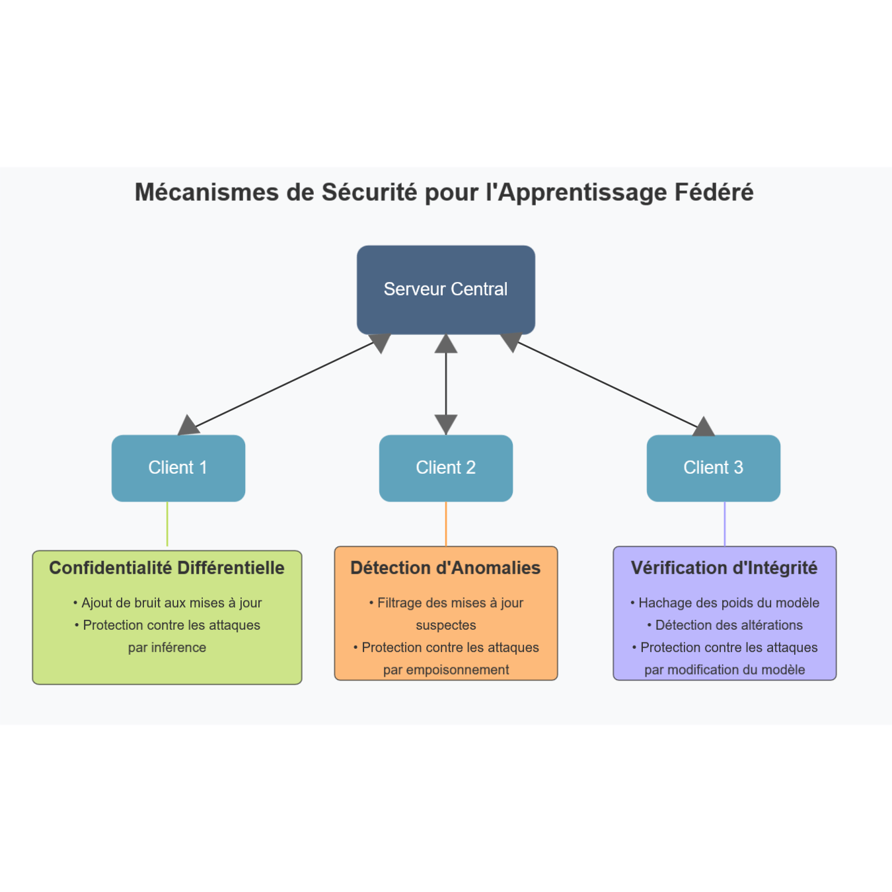

<div class="title">Apprentissage Fédéré</div>
<div class="separator"></div>
<div class="subtitle">Sécurité, Confidentialité et Perspectives d'Avenir</div>

<div class="authors">
<p>Clément COLIN</p>
<p>Enzo ROCAMORA</p>
<p>Thomas CHOUBRAC</p>
</div>

<div class="authors">
<p>Avril 2025<p>
</div>

<div class="page"/>

## Sommaire

1. [Introduction à l'Apprentissage Fédéré et ses Enjeux de Sécurité](#1-introduction-à-lapprentissage-fédéré-et-ses-enjeux-de-sécurité)

2. [Paysage des Vulnérabilités et Menaces](#2-paysage-des-vulnérabilités-et-menaces)

3. [Analyse Approfondie des Menaces de Sécurité](#3-analyse-approfondie-des-menaces-de-sécurité)

4. [Mécanismes de Défense et Techniques de Protection](#4-mécanismes-de-défense-et-techniques-de-protection)

5. [Perspectives de Recherche et Innovations](#5-perspectives-de-recherche-et-innovations)

6. [Études de Cas: Sécurité dans les Déploiements](#6-études-de-cas-sécurité-dans-les-déploiements)

7. [Implications Réglementaires et Éthiques](#7-implications-réglementaires-et-éthiques)

8. [Défis Opérationnels et Mise en Œuvre](#8-implémentation-pratique-des-mécanismes-de-sécurité)

9. [Perspectives d'Avenir à Court et Moyen Terme](#9-perspectives-davenir-à-court-et-moyen-terme)

10. [Conclusion](#10-conclusion-vers-un-apprentissage-fédéré-sécurisé)

11. [Références](#11-références)

<div class="page"/>

## 1. Introduction à l'Apprentissage Fédéré et ses Enjeux de Sécurité

L'intelligence artificielle contemporaine a connu une évolution remarquable au cours des dernières années, notamment grâce à l'émergence de nouvelles approches qui redéfinissent la manière dont les modèles d'apprentissage sont développés et déployés. Parmi ces innovations, l'Apprentissage Fédéré (Federated Learning ou FL) se distingue comme un paradigme révolutionnaire qui repense fondamentalement la relation entre les données et les algorithmes. Contrairement aux méthodes traditionnelles d'apprentissage automatique où les données des utilisateurs sont centralisées sur un serveur pour l'entraînement des modèles, l'Apprentissage Fédéré propose une approche décentralisée qui préserve la confidentialité des données.

Tel que présenté dans la littérature scientifique, notamment par McMahan et ses collaborateurs, l'Apprentissage Fédéré représente une nouvelle génération d'intelligence artificielle qui s'appuie sur l'entraînement décentralisé, rapprochant ainsi l'apprentissage des appareils périphériques. Ce paradigme innovant est souvent qualifié de "nouvelle aube de l'IA", bien qu'il demeure encore dans ses phases initiales de développement. Sa pleine adoption reste freinée par diverses préoccupations, particulièrement en matière de sécurité et de confidentialité, qui constituent le cœur de notre analyse.

La philosophie sous-jacente à l'Apprentissage Fédéré pourrait être résumée par cette phrase éloquente : "FL amène le code aux données, plutôt que les données au code". Cette approche répond directement aux problématiques de confidentialité, de propriété et de localité des données. Dans ce cadre, les paramètres du modèle voyagent entre un serveur central et les dispositifs clients, permettant ainsi un entraînement collaboratif sans jamais exposer les données brutes des utilisateurs. Cependant, cette circulation des paramètres introduit de nouvelles surfaces d'attaque et vulnérabilités qui nécessitent une attention particulière.

L'émergence de l'Apprentissage Fédéré s'inscrit dans un contexte sociétal et législatif où la protection des données personnelles devient une préoccupation majeure. Avec l'entrée en vigueur de réglementations strictes comme le Règlement Général sur la Protection des Données (RGPD) en Europe et le California Consumer Privacy Act (CCPA) aux États-Unis, les organisations sont confrontées à des exigences croissantes en matière de minimisation des données et de transparence. L'Apprentissage Fédéré apparaît ainsi comme une réponse technologique à ces contraintes réglementaires, permettant l'exploitation des données à des fins d'apprentissage tout en respectant les principes fondamentaux de la protection de la vie privée.

Si la promesse de l'Apprentissage Fédéré repose sur l'amélioration de la confidentialité des données, Mothukuri et al. ainsi que Li et al. soulignent dans leurs travaux que cette approche n'est pas exempte de vulnérabilités sécuritaires et de risques pour la vie privée. Le partage des paramètres du modèle, bien que moins sensible que les données brutes, peut néanmoins révéler des informations confidentielles lorsqu'il est soumis à des techniques d'attaque sophistiquées. De plus, la nature distribuée du processus d'apprentissage ouvre la porte à des altérations malveillantes par des participants adverses. Comprendre ces risques et développer des contre-mesures efficaces constitue un prérequis essentiel pour que l'Apprentissage Fédéré puisse tenir ses promesses en matière de protection des données sans compromettre la performance des modèles générés.

## 2. Paysage des Vulnérabilités et Menaces

L'Apprentissage Fédéré s'articule autour de plusieurs approches et techniques dont les implications en matière de sécurité et de confidentialité varient considérablement. Cette section explore systématiquement les vulnérabilités sécuritaires inhérentes aux différentes architectures et protocoles de FL, offrant ainsi une cartographie complète des risques potentiels.

### Modèles d'Attaque et Classification des Menaces

Avant d'examiner les vulnérabilités spécifiques, il est essentiel d'établir une taxonomie structurée des modèles d'attaque dans le contexte de l'Apprentissage Fédéré. Mothukuri et al. proposent une classification selon plusieurs dimensions clés.

La première dimension concerne le rôle de l'attaquant dans le système fédéré. Un attaquant peut agir en tant que participant au processus d'apprentissage (client malveillant), en tant que serveur d'agrégation, ou comme observateur externe interceptant les communications. Chaque position offre des capacités et contraintes distinctes pour l'adversaire.

Une deuxième dimension fondamentale est l'objectif de l'attaque. Les attaques peuvent viser à compromettre l'intégrité du modèle (en dégradant ses performances ou en induisant des comportements spécifiques), à extraire des informations confidentielles des données d'entraînement, ou à perturber la disponibilité du système (par exemple, en causant une divergence dans le processus d'apprentissage).

La connaissance préalable à disposition de l'attaquant constitue une troisième dimension critique. Les attaques en boîte blanche supposent une connaissance complète de l'architecture du modèle et parfois des données d'autres participants, tandis que les attaques en boîte noire s'appuient uniquement sur les informations publiques ou accessibles via des interfaces légitimes.

### Vulnérabilités dans les Architectures Fédérées

Les différentes architectures de l'Apprentissage Fédéré présentent des profils de vulnérabilité distincts. Dans l'architecture centralisée classique (client-serveur), le serveur d'agrégation représente un point unique de défaillance, dont la compromission peut affecter l'ensemble du système. De plus, ce serveur central dispose d'une visibilité privilégiée sur les mises à jour de tous les participants, ce qui peut faciliter les attaques par inférence si ce serveur est malveillant ou compromis.

Les architectures décentralisées (pair-à-pair) éliminent cette vulnérabilité centrale mais introduisent de nouveaux risques. L'absence d'entité de coordination complique l'identification et l'exclusion des nœuds malveillants. De plus, les communications directes entre participants multiplient les surfaces d'attaque et peuvent faciliter les attaques ciblées ou l'établissement de coalitions adverses.

Les architectures hiérarchiques, qui intègrent des agrégateurs intermédiaires, présentent quant à elles des vulnérabilités hybrides. La compromission d'un agrégateur intermédiaire peut affecter tout un sous-ensemble de participants sans nécessairement compromettre l'ensemble du système. Cette architecture peut également faciliter les attaques sélectives, où un adversaire cible spécifiquement certains groupes de participants.

### Protocoles de Communication et Vulnérabilités

L'aspect communication constitue une dimension critique de la sécurité dans l'Apprentissage Fédéré. Les protocoles synchrones, qui attendent la contribution de tous les participants sélectionnés avant de mettre à jour le modèle global, sont particulièrement vulnérables aux attaques de déni de service. Un attaquant peut retarder considérablement le processus d'apprentissage en ralentissant délibérément ses propres contributions.

Les protocoles asynchrones, bien que plus résistants aux retards intentionnels, introduisent d'autres vulnérabilités. La possibilité d'intégrer les contributions au fur et à mesure de leur disponibilité peut faciliter les attaques par empoisonnement ciblées temporellement, où un adversaire attend que certaines conditions soient réunies avant de soumettre une contribution malveillante.

Les mécanismes de sélection des participants présentent également des risques significatifs. Si la sélection est prévisible ou manipulable, un adversaire pourrait augmenter stratégiquement sa présence dans certaines rounds d'entraînement pour maximiser son impact sur le modèle global.

### Frameworks et Implémentations: Analyse de Sécurité

L'examen des frameworks d'Apprentissage Fédéré les plus utilisés révèle des profils de sécurité variables. TensorFlow Federated (TFF) propose des mécanismes de sécurité comme l'agrégation sécurisée et des options pour la confidentialité différentielle, mais ces fonctionnalités restent optionnelles et leur activation peut significativement impacter les performances. FATE intègre davantage de mécanismes cryptographiques par défaut, notamment pour les scénarios d'Apprentissage Fédéré vertical, mais impose en contrepartie une surcharge computationnelle plus importante.

PySyft se distingue par son intégration poussée de primitives cryptographiques comme le calcul multi-parties sécurisé et le chiffrement homomorphe, offrant des garanties théoriques fortes mais au prix d'une complexité accrue et de limitations pratiques significatives en termes de performance. Flower, plus récent, met l'accent sur la flexibilité mais laisse largement la responsabilité des mécanismes de sécurité aux développeurs.

Cette diversité d'approches souligne l'absence actuelle de standards de sécurité établis dans le domaine de l'Apprentissage Fédéré, laissant aux implémenteurs la charge de naviguer entre garanties théoriques, contraintes pratiques et exigences spécifiques à leur contexte d'application.

## 3. Analyse Approfondie des Menaces de Sécurité

L'Apprentissage Fédéré introduit des vulnérabilités spécifiques qui peuvent être exploitées par des adversaires sophistiqués. Ces menaces peuvent être classifiées selon leur cible principale: l'intégrité du modèle, la confidentialité des données, ou la disponibilité du système.

<div class="page"/>

### Attaques contre l'Intégrité du Modèle

#### Empoisonnement des Données et des Modèles

L'empoisonnement représente une menace fondamentale où un participant malveillant manipule ses contributions pour compromettre le modèle global. L'empoisonnement des données consiste à altérer délibérément les données d'entraînement locales, tandis que l'empoisonnement des modèles, plus sophistiqué, implique la manipulation directe des mises à jour des paramètres.

Dans sa forme non ciblée, l'attaquant cherche simplement à dégrader les performances globales du modèle. Plus subtilement, l'empoisonnement ciblé vise à modifier le comportement du modèle uniquement pour certaines entrées spécifiques tout en maintenant des performances normales sur les autres données, rendant l'attaque difficile à détecter.

#### Attaques par Porte Dérobée

Les attaques par porte dérobée (*backdoor attacks*) implantent des vulnérabilités exploitables ultérieurement. Contrairement à l'empoisonnement général, ces attaques créent des comportements anormaux du modèle qui ne se manifestent que lorsque certains déclencheurs spécifiques sont présents dans les données d'entrée.

Li et al. notent que la persistance de ces vulnérabilités constitue un défi majeur. Même après l'exclusion d'un client malveillant, les portes dérobées peuvent persister dans le modèle global pendant plusieurs itérations d'entraînement, particulièrement si elles ont été conçues pour résister aux processus d'agrégation et de mise à jour ultérieurs.

### Attaques contre la Confidentialité des Données

#### Attaques par Inférence et Reconstruction

Malgré l'absence de partage direct des données brutes, les mises à jour des modèles partagées dans l'Apprentissage Fédéré peuvent révéler des informations sensibles sur les données d'entraînement.

Les attaques par inférence de membres visent à déterminer si un échantillon spécifique a fait partie des données d'entraînement d'un participant. Ces attaques exploitent le fait que les modèles réagissent différemment aux exemples sur lesquels ils ont été entraînés, créant une signature statistique détectable.

Plus préoccupantes encore, les attaques par reconstruction tentent de recréer partiellement ou complètement les données d'entraînement originales à partir des gradients partagés. Dans certains cas, particulièrement avec des modèles surparamétrés, ces techniques peuvent reconstruire avec une précision surprenante les exemples d'entraînement.

<div class="page"/>

### Attaques contre la Disponibilité

Les attaques contre la disponibilité visent à perturber le processus d'entraînement collaboratif. Les attaques par déni de service peuvent exploiter les protocoles synchrones en retardant délibérément les contributions, forçant l'ensemble du système à attendre. Les attaques de Sybil, où un adversaire crée et contrôle de multiples identités fictives, peuvent amplifier significativement l'impact des autres types d'attaques en augmentant artificiellement l'influence de l'attaquant sur le système.

## 4. Mécanismes de Défense et Techniques de Protection

Face aux multiples vulnérabilités identifiées, différentes stratégies de défense ont été proposées pour renforcer la sécurité et la confidentialité des systèmes d'Apprentissage Fédéré.

### Défenses contre les Attaques d'Intégrité

#### Mécanismes d'Agrégation Robuste

L'agrégation robuste constitue une première ligne de défense contre les attaques par empoisonnement en limitant l'influence des mises à jour malveillantes sur le modèle global.

La médiane coordonnée-par-coordonnée remplace la moyenne traditionnelle des gradients par leur médiane, réduisant significativement l'impact des valeurs aberrantes. L'agrégation par moyennes tronquées exclut une fraction des valeurs extrêmes avant de calculer la moyenne des contributions restantes.

L'agrégation par moyenne pondérée par la réputation attribue des poids différents aux participants en fonction de leur historique de contributions, réduisant progressivement l'influence des clients produisant des mises à jour statistiquement aberrantes.

#### Détection d'Anomalies et Filtrage

Les approches basées sur la détection d'anomalies visent à identifier et exclure les contributions malveillantes avant leur intégration dans le modèle global.

Les méthodes basées sur les normes utilisent des statistiques simples comme la norme L1 ou L2 des mises à jour pour identifier les contributions anormalement grandes ou divergentes. Les approches basées sur la cohérence vérifient la cohérence interne des mises à jour soumises, par exemple en analysant les relations entre différentes couches d'un réseau de neurones.

La validation croisée fédérée consiste à évaluer l'impact des mises à jour proposées sur un ensemble de validation, permettant d'identifier efficacement les contributions qui dégradent les performances globales.

<div class="page"/>

### Protections de la Confidentialité

#### Confidentialité Différentielle

La confidentialité différentielle (DP) constitue l'approche la plus établie pour protéger formellement les données privées. Ce cadre mathématique offre des garanties quantifiables quant à la capacité d'un adversaire à inférer des informations sur les données individuelles.

La confidentialité différentielle centralisée considère le serveur d'agrégation comme une entité de confiance et vise à protéger les données contre les attaques externes. La confidentialité différentielle locale offre des garanties plus fortes en supposant que même le serveur d'agrégation peut être malveillant. Chaque client perturbe ses mises à jour localement avant de les partager, assurant ainsi que même le serveur ne peut extraire d'informations sensibles.

#### Techniques Cryptographiques

Les approches cryptographiques visent à protéger la confidentialité des données et des modèles par des garanties mathématiques formes, sans nécessairement introduire de dégradation intentionnelle de l'information.

Le calcul multi-parties sécurisé (SMC) permet à plusieurs entités de calculer conjointement une fonction sur leurs données privées sans révéler ces données aux autres participants. Le chiffrement homomorphe permet d'effectuer des opérations mathématiques directement sur des données chiffrées, sans nécessiter leur déchiffrement préalable.

### Compromis Fondamentaux

Les mécanismes de défense illustrent le trilemme fondamental de l'Apprentissage Fédéré: il semble impossible d'optimiser simultanément la confidentialité, l'efficacité et la précision du modèle.

La confidentialité différentielle dégrade intentionnellement la qualité des mises à jour pour garantir la protection des données individuelles. Les approches cryptographiques préservent la précision du modèle mais imposent une surcharge computationnelle considérable. Les mécanismes d'agrégation robuste, en filtrant certaines contributions, risquent d'écarter des informations légitimes mais atypiques.

Ces compromis incontournables soulignent l'importance d'une approche contextuelle de la sécurité dans l'Apprentissage Fédéré, où les mécanismes de protection sont sélectionnés et calibrés en fonction des menaces spécifiques et des exigences de chaque application.

<div class="page"/>

## 5. Perspectives de Recherche et Innovations

Face aux vulnérabilités identifiées et aux limitations des mécanismes actuels, plusieurs pistes de recherche émergent pour renforcer la sécurité et la confidentialité des systèmes d'Apprentissage Fédéré.

### Architectures de Sécurité Avancées

#### Architectures Multi-niveaux Sécurisées

Une direction prometteuse concerne le développement d'architectures de sécurité multi-niveaux qui intègrent différentes approches de protection à différentes étapes du processus fédéré. Ces architectures pourraient combiner des mécanismes complémentaires pour atténuer un large spectre de menaces tout en optimisant le compromis entre sécurité et performance.

Par exemple, la confidentialité différentielle pourrait être appliquée aux données particulièrement sensibles, tandis que des techniques cryptographiques plus lourdes seraient réservées aux opérations critiques comme l'agrégation finale.

#### Sécurité Adaptative Contextuelle

Les systèmes de sécurité adaptatifs, qui ajustent leurs mécanismes de protection en fonction du contexte, offrent une voie prometteuse pour optimiser l'équilibre entre sécurité et performance.

L'analyse comportementale des participants permettrait d'ajuster le niveau de confiance accordé à chacun en fonction de son historique de contributions. L'adaptation aux menaces détectées permettrait au système de renforcer spécifiquement les défenses contre les types d'attaques identifiés comme actifs ou probables.

### Techniques de Détection et Réponse Avancées

#### Détection Basée sur l'Intelligence Artificielle

L'application de techniques avancées d'intelligence artificielle pour la détection des comportements malveillants représente une piste particulièrement prometteuse. Ces approches exploitent des modèles sophistiqués pour identifier des patterns subtils dans les contributions des participants.

Les réseaux adverses génératifs (GANs) peuvent être adaptés pour créer des "détecteurs d'anomalies" spécialisés dans l'identification des mises à jour suspectes. Les techniques d'apprentissage par renforcement permettraient de développer des agents de détection qui s'améliorent continuellement au fur et à mesure de leur exposition à de nouvelles variantes d'attaques.

<div class="page"/>

#### Réponse Automatisée aux Incidents

Au-delà de la simple détection, le développement de mécanismes automatisés de réponse aux incidents de sécurité constitue une direction essentielle. Ces systèmes viseraient à maintenir l'intégrité du processus d'apprentissage même en présence d'attaques actives.

Les techniques de récupération sélective permettraient de "réparer" un modèle compromis sans nécessiter un réentraînement complet. Les mécanismes d'isolation dynamique des participants permettraient d'exclure temporairement les clients suspects, tout en leur offrant des voies de réhabilitation après vérification.

### Apprentissage Fédéré à Confidentialité Préservée par Construction

#### Architectures Préservant Intrinsèquement la Confidentialité

Une direction particulièrement prometteuse concerne le développement d'architectures d'Apprentissage Fédéré qui préservent intrinsèquement la confidentialité, sans nécessiter l'ajout de mécanismes de protection supplémentaires.

Les approches par distillation exploitent le principe que le transfert de connaissances entre modèles peut être réalisé en partageant uniquement des prédictions sur des données publiques, plutôt que les paramètres des modèles eux-mêmes. Les architectures modulaires décomposent le modèle en composants avec différentes sensibilités et exigences de confidentialité.

Ces innovations, combinées à l'établissement de cadres théoriques unifiés et de métriques standardisées, permettront d'améliorer significativement la sécurité des systèmes d'Apprentissage Fédéré tout en préservant leur utilité pratique.

## 6. Études de Cas: Sécurité dans les Déploiements

L'examen des déploiements concrets d'Apprentissage Fédéré révèle comment les considérations théoriques de sécurité et de confidentialité se traduisent en solutions pratiques.

### Sécurité dans les Systèmes de Santé Fédérés

#### Le Consortium MELLODDY

Le projet MELLODDY (Machine Learning Ledger Orchestration for Drug Discovery) représente un cas d'étude remarquable d'Apprentissage Fédéré dans un contexte hautement compétitif. Ce consortium réunit dix grandes entreprises pharmaceutiques européennes pour développer collaborativement des modèles prédictifs pour la découverte de médicaments sans compromettre leurs secrets industriels.

<div class="page"/>

L'architecture de sécurité repose sur plusieurs couches de protection: chiffrement homomorphe pour les opérations d'agrégation, calcul multi-parties sécurisé pour certaines phases critiques, et confidentialité différentielle calibrée spécifiquement pour les données chimiques. Pour prévenir les attaques par empoisonnement, chaque contribution est validée par un comité technique indépendant sans accéder aux données sous-jacentes.

Les leçons clés soulignent l'importance d'une conception de sécurité adaptée au contexte spécifique et aux motivations des adversaires potentiels – dans ce cas, des concurrents industriels avec des intérêts économiques substantiels.

#### EXAM: Confidentialité des Données Médicales

L'initiative EXAM (Electronic Cross-Hospital Artificial Intelligence Medicine) illustre les défis spécifiques aux collaborations inter-hospitalières pour le développement de modèles de diagnostic basés sur l'imagerie médicale.

Son architecture de sécurité se distingue par une approche modulaire qui catégorise les différentes opérations selon leur niveau de risque et applique des protections proportionnées. Pour contrer les attaques par reconstruction d'images, EXAM implémente une combinaison de techniques de minimisation d'information, où les images sont prétraitées localement pour extraire uniquement les caractéristiques pertinentes.

Cette expérience souligne l'importance d'une approche qui préserve non seulement la confidentialité abstraite des données, mais également la précision diagnostique pour les cas critiques où des erreurs pourraient avoir des conséquences graves.

### Protection des Données Financières

Un consortium de banques européennes a déployé une solution d'Apprentissage Fédéré pour la détection de fraudes par carte de crédit, illustrant les défis dans un contexte où les données sont extrêmement sensibles et les adversaires hautement motivés.

L'architecture repose sur un modèle de confiance graduée avec différents niveaux d'accès et de privilèges. Pour contrer les attaques par inférence ciblant des informations commercialement sensibles, le système combine confidentialité différentielle et partitionnement sécurisé. Face au risque d'empoisonnement stratégique, il emploie une agrégation robuste multi-niveau.

Les leçons tirées soulignent l'importance d'aligner les mécanismes de sécurité avec les modèles d'incitation économique des participants, qui partagent ici un intérêt fondamental à maintenir l'intégrité du système malgré leur position concurrentielle.

<div class="page"/>

## 7. Implications Réglementaires et Éthiques

Au-delà des aspects purement techniques, la sécurité et la confidentialité de l'Apprentissage Fédéré soulèvent des questions réglementaires et éthiques complexes.

### Cadres Réglementaires et Conformité

#### Conformité aux Réglementations de Protection des Données

L'Apprentissage Fédéré émerge dans un paysage réglementaire évolutif concernant la protection des données personnelles. Bien qu'aligné avec l'esprit du RGPD européen ou du CCPA californien, son implémentation soulève des questions d'interprétation juridique.

Mothukuri et al. soulignent que malgré l'absence de centralisation des données brutes, certains aspects de l'Apprentissage Fédéré pourraient tomber sous le coup de ces réglementations. Les mises à jour de modèles partagées pourraient être considérées comme des "données personnelles" si elles permettent l'identification d'individus via des attaques par inférence.

Le "droit à l'oubli" pose des défis techniques particuliers dans ce contexte. Contrairement aux systèmes centralisés, l'influence des données d'un utilisateur est diffusée à travers les paramètres du modèle global de manière difficile à isoler. Des recherches explorent des mécanismes de "désapprentissage" permettant de retirer l'influence de données spécifiques sans réentraînement complet.

#### Certification et Standards Émergents

Face aux incertitudes réglementaires, plusieurs initiatives de standardisation émergent pour établir des pratiques communes en matière de sécurité et de confidentialité.

L'ISO/IEC développe des extensions à ses standards existants sur la protection de la vie privée pour couvrir spécifiquement les paradigmes d'apprentissage distribué. Des consortiums industriels comme l'Open Federated Learning travaillent à l'établissement de standards techniques définissant des protocoles de communication sécurisés et des métriques d'évaluation des risques.

### Considérations Éthiques et Sociétales

#### Équité Algorithmique et Fracture Numérique

L'équité algorithmique prend une dimension supplémentaire dans le contexte fédéré. La nature décentralisée de l'apprentissage peut soit atténuer soit amplifier les biais présents dans les données selon les mécanismes d'agrégation et les distributions entre participants.

Les mécanismes de sécurité eux-mêmes peuvent introduire des iniquités. Par exemple, les techniques de confidentialité différentielle peuvent avoir un impact disproportionné sur les groupes minoritaires dont les patterns distinctifs sont plus facilement masqués par l'ajout de bruit.

Les exigences de sécurité soulèvent également des questions d'accessibilité technologique. Mothukuri et al. notent que les approches cryptographiques avancées nécessitent des ressources considérables, potentiellement inaccessibles aux appareils d'entrée de gamme, risquant d'exacerber la fracture numérique existante.

### Gouvernance et Responsabilité Partagée

La nature distribuée de l'Apprentissage Fédéré nécessite des modèles de gouvernance innovants définissant clairement les responsabilités en matière de sécurité. Contrairement aux systèmes centralisés, les environnements fédérés impliquent un partage complexe des obligations entre multiples parties prenantes.

Li et al. proposent plusieurs modèles adaptés à différents contextes. Le modèle "centralisé-responsable" confie la responsabilité principale à une entité centrale qui impose des politiques uniformes. Le modèle "décentralisé-démocratique" distribue les responsabilités entre tous les participants qui définissent collectivement les politiques par des mécanismes de consensus.

La transparence des mécanismes de sécurité constitue un principe fondamental pour établir la confiance, mais doit être calibrée pour ne pas compromettre l'efficacité des protections. Des approches innovantes explorent le concept d'"auditabilité sélective" permettant de vérifier certains aspects critiques sans révéler tous les détails qui pourraient être exploités par des attaquants.

## 8. Implémentation Pratique des Mécanismes de Sécurité

La mise en œuvre des concepts de sécurité dans l'Apprentissage Fédéré nécessite des modifications spécifiques au code. Cette section présente des techniques pratiques pour renforcer la sécurité du système fédéré existant, sans nécessiter de refonte complète de l'architecture.

<div class="page"/>

### 8.1 Ajout de Confidentialité Différentielle

L'implémentation de la confidentialité différentielle dans `aggregation.py` peut protéger efficacement contre les attaques par inférence.

```python
def add_diff_privacy(client_updates, noise_scale=0.01, clip_norm=1.0):
    """Ajoute de la confidentialité différentielle aux mises à jour des clients."""
    clipped_updates = []
    
    # Écrêtage des normes des gradients
    for update in client_updates:
        update_clipped = []
        for layer in update:
            norm = tf.norm(layer)
            scale_factor = tf.minimum(1.0, clip_norm / (norm + 1e-10))
            update_clipped.append(layer * scale_factor)
        clipped_updates.append(update_clipped)
    
    # Ajout de bruit gaussien calibré
    noisy_updates = []
    for update in clipped_updates:
        noisy_update = []
        for layer in update:
            noise = tf.random.normal(shape=tf.shape(layer), 
                                    mean=0.0, 
                                    stddev=noise_scale * clip_norm)
            noisy_update.append(layer + noise)
        noisy_updates.append(noisy_update)
    
    return noisy_updates
```

Pour utiliser cette fonction, il faudrait modifier les algorithmes d'agrégation existants pour incorporer cette étape, par exemple dans `fedavg`:

```python
def fedavg(scaled_weight_list, central_weights=None, config_name=None, round_num=None, dp_params=None):
    # Appliquer la confidentialité différentielle si demandé
    if dp_params is not None:
        scaled_weight_list = add_differential_privacy(
            scaled_weight_list, 
            noise_scale=dp_params.get('noise_scale', 0.01),
            clip_norm=dp_params.get('clip_norm', 1.0)
        )
    
    # Reste du code inchangé...
```

### 8.2 Détection d'Anomalies pour la Sécurité

Une fonction de détection d'anomalies dans les mises à jour des clients peut être ajoutée dans `fl_types.py` pour identifier et filtrer les contributions potentiellement malveillantes:

```python
def detect_anomalous_updates(client_updates, method='norm', threshold=2.0):
    """Détecte les mises à jour anormales."""
    if method == 'norm':
        # Calculer la norme L2 de chaque mise à jour
        norms = []
        for update in client_updates:
            total_norm = 0
            for layer in update:
                layer_norm = tf.norm(layer)
                total_norm += layer_norm ** 2
            norms.append(tf.sqrt(total_norm))
        
        # Calculer statistiques
        mean_norm = tf.reduce_mean(norms)
        std_norm = tf.math.reduce_std(norms)
        
        # Identifier les anomalies (basées sur z-score)
        is_anomalous = [norm > mean_norm + threshold * std_norm for norm in norms]
        
        return is_anomalous
```

Cette fonction pourrait être intégrée dans le processus d'apprentissage fédéré:

```python
def horizontal_federated_learning(edges, central_model, input_shape, num_classes, 
                                 edge_epochs, test_data, aggregation_fn, 
                                 anomaly_detection=False, verbose=0):
    # Code existant...
    if anomaly_detection:
        anomalies = detect_anomalous_updates(scaled_local_weight_list)
        
        # Filtrer les mises à jour anormales
        filtered_weight_list = [w for i, w in enumerate(scaled_local_weight_list) if not anomalies[i]]
        
        # Utiliser la liste filtrée
        updated_weights = aggregation_fn(filtered_weight_list)
    else:
        updated_weights = aggregation_fn(scaled_local_weight_list)
    
    # Code existant...
```

### 8.3 Vérification d'Intégrité des Modèles

Un mécanisme simple de vérification d'intégrité peut être implémenté pour s'assurer que les mises à jour des modèles n'ont pas été altérées. Cela pourrait être ajouté à `fl_model.py`:

```python
import hashlib

def compute_model_hash(model_weights):
    """Calcule une empreinte numérique des poids du modèle."""
    # Convertir les poids en bytes pour le hashing
    combined = b''
    for w in model_weights:
        combined += w.numpy().tobytes()
    
    # Calculer le hash SHA-256
    return hashlib.sha256(combined).hexdigest()

def verify_integrity(self, original_hash):
    """Vérifie que le modèle n'a pas été altéré."""
    current_hash = compute_model_hash(self.get_weights())
    return current_hash == original_hash
```

<div class="page"/>

### 8.4 Schéma des Mécanismes de Sécurité Proposés



<div class="page"/>

### 8.5 Avantages et Limites

#### Avantages

Ces mécanismes de sécurité offrent plusieurs avantages immédiats:

- **Protection contre les inférences**: La confidentialité différentielle permet de masquer l'information identifiable dans les mises à jour des modèles sans compromettre significativement leur utilité pour l'apprentissage global.
  
- **Résilience aux attaques par empoisonnement**: La détection d'anomalies permet d'identifier et d'exclure les contributions malveillantes avant qu'elles ne corrompent le modèle global.
  
- **Traçabilité et audit**: La vérification d'intégrité fournit un mécanisme simple mais efficace pour détecter les altérations non autorisées des modèles.

#### Limites

Ces approches comportent également certaines limitations:

- **Compromis performance-sécurité**: L'ajout de bruit dans la confidentialité différentielle peut réduire la précision du modèle final, nécessitant un calibrage soigneux du paramètre de bruit.
  
- **Risque de faux positifs**: Les mécanismes de détection d'anomalies peuvent parfois exclure des contributions légitimes mais inhabituelles, particulièrement dans les scénarios non-IID extrêmes.
  
- **Surcharge computationnelle**: Ces mécanismes ajoutent une charge de calcul supplémentaire qui peut être significative, particulièrement pour les dispositifs à ressources limitées.

### 8.6 Intégration dans le Pipeline d'Entraînement

Pour intégrer ces mécanismes dans le pipeline existant, il faudrait modifier le fichier `run_all.py` pour permettre la configuration des paramètres de sécurité:

```python
configurations = [
    {'name': 'FedAvg_Secure', 'num_clients': 10, 'distribution': 'iid', 
     'algo': 'fedavg', 'epochs': 3, 'rounds': 5,
     'security': {
         'differential_privacy': {'enabled': True, 'noise_scale': 0.01, 'clip_norm': 1.0},
         'anomaly_detection': {'enabled': True, 'method': 'norm', 'threshold': 2.0},
         'integrity_verification': {'enabled': True}
     }
    },
]
```

Ces mécanismes de sécurité, bien que simples à implémenter, constituent une première ligne de défense efficace contre plusieurs classes d'attaques communes dans l'Apprentissage Fédéré, tout en conservant la flexibilité et la personnalisation offertes par l'architecture existante.

## 9. Perspectives d'Avenir à Court et Moyen Terme

### Évolutions Technologiques Imminentes

L'horizon 2025-2027 devrait voir l'émergence de plusieurs avancées significatives dans la sécurisation de l'Apprentissage Fédéré:

- **Systèmes adaptatifs de protection**: Des mécanismes qui ajustent automatiquement leur niveau de protection en fonction d'évaluations continues des menaces et des ressources disponibles.
- **Primitives cryptographiques efficientes**: Des implémentations optimisées du chiffrement homomorphe et du calcul multi-parties spécifiquement conçues pour les opérations d'Apprentissage Fédéré.
- **Frameworks intégrés**: Des plateformes offrant une intégration transparente de multiples mécanismes de protection complémentaires avec des configurations pré-optimisées pour différents scénarios.

### Tendances d'Adoption et Standardisation

Les tendances réglementaires et industrielles actuelles suggèrent plusieurs évolutions probables:

- Émergence de standards de certification spécifiques à l'Apprentissage Fédéré, potentiellement inspirés des cadres existants comme SOC2 ou les normes ISO 27000
- Adoption croissante dans les secteurs hautement réglementés comme la santé et la finance, où les bénéfices en termes de conformité réglementaire justifient les investissements dans cette technologie
- Développement de places de marché fédérées sécurisées permettant l'échange commercial de modèles et de contributions d'entraînement avec des garanties formelles de sécurité

### Ressources pour les Implémentations Sécurisées

Pour les organisations souhaitant déployer des systèmes d'Apprentissage Fédéré sécurisés, plusieurs ressources et outils émergent:

- **Bibliothèques spécialisées**: FATE, TensorFlow Federated et PySyft intègrent progressivement des primitives de sécurité robustes avec des interfaces simplifiées
- **Méthodologies d'évaluation**: Des outils comme "FL-Security-Bench" permettent d'évaluer systématiquement la résistance des systèmes fédérés contre diverses classes d'attaques
- **Communautés de pratique**: Des groupes comme "OpenFL Security Working Group" et "PPML Alliance" facilitent le partage de bonnes pratiques et de patterns d'implémentation sécurisés

<div class="page"/>

## 10. Conclusion: Vers un Apprentissage Fédéré Sécurisé

Au terme de cette analyse approfondie des aspects sécuritaires et de confidentialité de l'Apprentissage Fédéré, plusieurs constats fondamentaux émergent qui définissent les enjeux présents et futurs de cette technologie prometteuse.

### Équilibre des Forces et Faiblesses

L'Apprentissage Fédéré représente une avancée significative dans la réconciliation entre l'exploitation collaborative des données et la protection de la vie privée. En maintenant les données brutes sur les dispositifs des utilisateurs ou au sein des organisations, cette approche élimine certaines vulnérabilités traditionnelles liées à la centralisation des données sensibles. Cependant, cette décentralisation s'accompagne de nouvelles surfaces d'attaque et de vulnérabilités spécifiques.

La richesse des attaques documentées témoigne d'une tension intrinsèque: le partage des mises à jour de modèles, nécessaire à l'apprentissage collaboratif, constitue inévitablement un canal d'information pouvant être exploité par des adversaires sophistiqués.

L'analyse des mécanismes de défense révèle un trilemme persistant entre confidentialité, performance et efficacité computationnelle. Ce trilemme ne représente pas un échec de l'ingénierie actuelle mais reflète des contraintes fondamentales probablement insurmontables dans leur totalité.

### Perspectives d'Évolution Sécuritaire

Malgré ces défis, les directions de recherche identifiées offrent des perspectives encourageantes. L'approche contextuelle et adaptative de la sécurité, qui module les mécanismes de protection en fonction des risques spécifiques et des ressources disponibles, semble particulièrement prometteuse pour des déploiements pratiques.

L'intégration de couches de protection complémentaires – combiner par exemple la confidentialité différentielle locale avec l'agrégation sécurisée et des mécanismes de détection d'anomalies – offre une résilience accrue face à la diversité des menaces.

Les études de cas présentées démontrent que des implémentations pratiques peuvent effectivement atteindre un équilibre viable entre protection et utilité, à condition d'être soigneusement calibrées pour leur contexte spécifique.

En définitive, l'Apprentissage Fédéré représente une évolution significative plutôt qu'une révolution absolue dans la réconciliation entre les bénéfices de l'intelligence artificielle collaborative et les impératifs de protection des données. Sa valeur réside précisément dans sa capacité à élargir l'espace des compromis viables, permettant dans de nombreux contextes de déplacer favorablement l'équilibre entre utilité et protection. Le chemin vers sa maturité impliquera une vigilance constante face aux vulnérabilités émergentes et une innovation continue dans les mécanismes de protection.

<div class="page"/>

## 11. Références

Mothukuri, V., Parizi, R. M., Pouriyeh, S., Huang, Y., Dehghantanha, A., & Srivastava, G. (2021). A survey on security and privacy of federated learning. *Future Generation Computer Systems*, 115, 619-640. https://doi.org/10.1016/j.future.2020.10.007

Li, Q., Diao, Y., Chen, Q., & He, B. (2023). A Survey on Federated Learning Systems: Vision, Hype and Reality for Data Privacy and Protection. *IEEE Transactions on Knowledge and Data Engineering*, 35(4), 3347-3366. https://doi.org/10.1109/TKDE.2021.3124599

McMahan, H. B., Moore, E., Ramage, D., Hampson, S., & y Arcas, B. A. (2017). Communication-efficient learning of deep networks from decentralized data. *Proceedings of the 20th International Conference on Artificial Intelligence and Statistics (AISTATS)*.

Bagdasaryan, E., Veit, A., Hua, Y., Estrin, D., & Shmatikov, V. (2020). How to backdoor federated learning. *International Conference on Artificial Intelligence and Statistics*, 2938-2948.

Nasr, M., Shokri, R., & Houmansadr, A. (2019). Comprehensive privacy analysis of deep learning: Passive and active white-box inference attacks against centralized and federated learning. *IEEE Symposium on Security and Privacy (SP)*, 739-753.

Zhu, L., Liu, Z., & Han, S. (2019). Deep leakage from gradients. *Advances in Neural Information Processing Systems*, 32.

Bonawitz, K., Ivanov, V., Kreuter, B., Marcedone, A., McMahan, H. B., Patel, S., Ramage, D., Segal, A., & Seth, K. (2017). Practical secure aggregation for privacy-preserving machine learning. *Proceedings of the 2017 ACM SIGSAC Conference on Computer and Communications Security*, 1175-1191.

Geyer, R. C., Klein, T., & Nabi, M. (2017). Differentially private federated learning: A client level perspective. *NIPS Workshop on Private Multi-Party Machine Learning*.

Kairouz, P., McMahan, H. B., Avent, B., Bellet, A., Bennis, M., Bhagoji, A. N., Bonawitz, K., Charles, Z., Cormode, G., Cummings, R., et al. (2021). Advances and open problems in federated learning. *Foundations and Trends in Machine Learning*, 14(1-2), 1-210.

Wang, H., Kaplan, Z., Niu, D., & Li, B. (2020). Optimizing federated learning on non-iid data with reinforcement learning. *IEEE INFOCOM 2020-IEEE Conference on Computer Communications*, 1698-1707.
